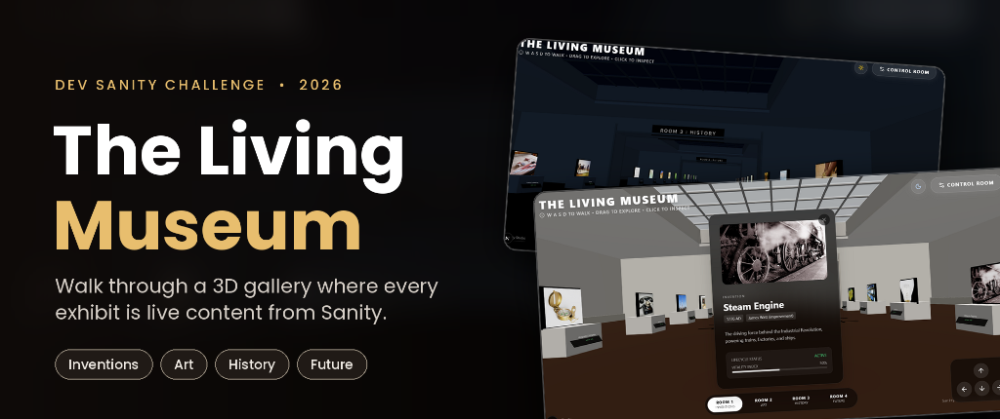

# 🏛️ The Living Museum — Sanity Challenge (Path 2)

  

  
  
  

> **Sanity Challenge Path 2: Vibe-Code Something Strange**  
> An interactive 3D digital museum where software architectures, retro milestones, and technological relics are immortalized as live exhibits managed entirely through **Sanity Content Lake**.

---

## 🌐 Live Deployments
* **Production Web App:** [https://sanity2-two.vercel.app](https://sanity2-two.vercel.app)
* **Sanity Studio CMS:** [https://sanity2-two.vercel.app/studio](https://sanity2-two.vercel.app/studio)
* **Mission Control Room:** [https://sanity2-two.vercel.app/control-room](https://sanity2-two.vercel.app/control-room)

---

## ✨ Features

### 1. 🚶 3D First-Person Walking & Arrow Controls
* Continuous 60 FPS movement through the grand exhibition hall using **W-A-S-D keys** or the on-screen **4-Button Arrow D-Pad** (Up, Down, Left, Right).
* OrbitControls with damped friction for natural looking and exploring.

### 2. 🏛️ The 4 Thematic Rooms
* **Room 1: Inventions** — Foundational breakthroughs (The Wheel, Steam Engine, Telephone, Light Bulb, Computer, The Internet).
* **Room 2: Art** — Classical marble sculptures, cave paintings, traditional Indian art, and digital creations.
* **Room 3: History** — Historic computer relics and coding milestones.
* **Room 4: Future** — Frontier AI models, smart cities, and autonomous systems.

### 3. 🔍 Interactive Item Inspection (Modal)
* Clicking any framed exhibit opens a glassmorphic modal displaying the authentic artifact image, era, creator, in-depth description, real-time Sanity lifecycle state (`ACTIVE` / `COOLING` / `ARCHIVED`), and live vitality progress bar.

### 4. 🌙 Atmospheric Dark / Night Mode
* A single click on the Sun/Moon toggle shifts the daytime sunlit skylight into a dark nocturnal gallery with spotlight lanterns.

### 5. 🎛️ Mission Control Room & Real-time Content Lake
* Overrides exhibit vitalities, triggers cooling cycles, or authorizes revival protocols live from the Control Room dashboard without page refreshes.

---

## 🛠️ Tech Stack
* **Framework:** Next.js 16 (App Router + Turbopack) + React 19 + TypeScript
* **3D Engine:** Three.js + React Three Fiber (`@react-three/fiber`) + Drei (`@react-three/drei`)
* **CMS & Content Lake:** Sanity CMS (`@sanity/client`, `@sanity/ui`, Next-Sanity)
* **Hosting:** Vercel Production Deployment

---

## 👤 Author
Developed with pride by **[Ayush Gupta](https://github.com/Ayushgupta1715)** for the Sanity DEV Challenge 2026.
